# Ecommerce-with-react

Ceci est un projet d'application web de e-commerce développée avec le framework JavaScript React. Ce projet a été réalisé lors de mon stage chez l'entreprise @TOGETTECH.

## Fonctionnalités

L'application est composée de trois parties principales : l'administration, les vendeurs et les clients.

### Partie Administrateur

La partie administrateur offre toutes les fonctionnalités et vues nécessaires à l'administration du site. L'administrateur peut effectuer les actions suivantes :

- Se connecter
- Inscrire/ajouter des vendeurs
- Supprimer des vendeurs
- Se déconnecter

### Partie Vendeur

La partie vendeur permet aux vendeurs de mener différentes actions sur la plateforme. Les fonctionnalités disponibles pour les vendeurs sont :

- Connexion
- Ajout de produits à leur liste de produits à vendre
- Ajout d'une promotion pour un ou plusieurs de leurs produits
- Consultation de la liste de leurs promotions
- Suppression d'une promotion
- Ajout d'un article de blog sur la plateforme
- Suppression de l'article de blog
- Déconnexion
- Consultation de la liste de leurs clients

### Partie Client

Lorsqu'un client accède à la plateforme, il a accès à la liste des produits proposés par les vendeurs ainsi qu'à des promotions disponibles. Les fonctionnalités pour les clients sont les suivantes :

- Consultation des produits et promotions
- Ajout de produits au panier
- Passage d'une commande une fois le panier prêt
- Connexion obligatoire pour finaliser la commande (utilisation de l'authentification Google OneTap)
- Saisie de l'adresse de livraison et du numéro de paiement (OM/MoMo)
- Réception d'une notification sur le téléphone pour valider le paiement
- Consultation des articles du blog du site

## Captures d'écran

Voici quelques captures d'écran illustrant les différentes fonctionnalités de l'application :

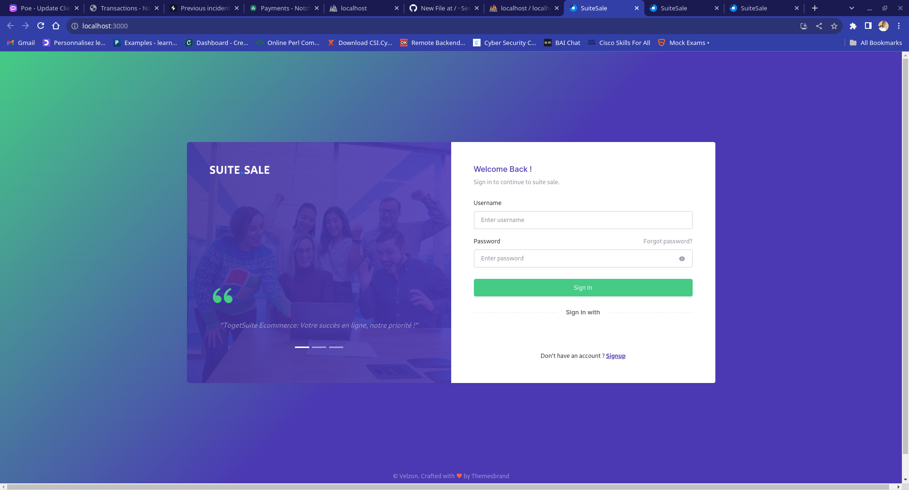

*Connexion -- Partie Administrateur*

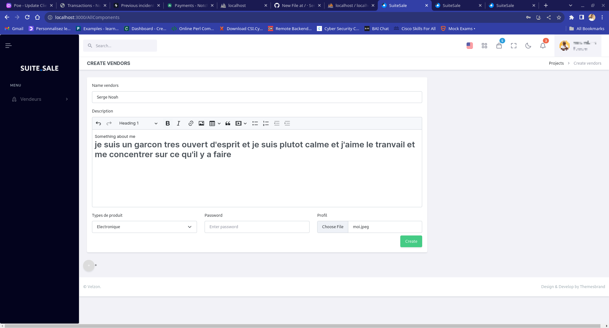

*Creation d'un compte vendeur -- Partie Administrateur*

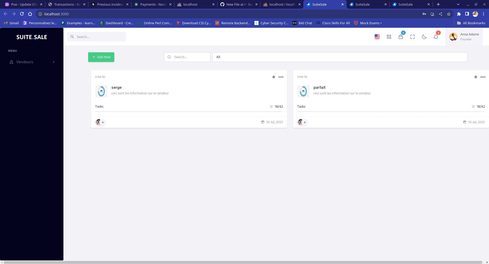
*Liste des vendeurs de la plateforme -- Partie Administrateur*

####Partie Administrateur

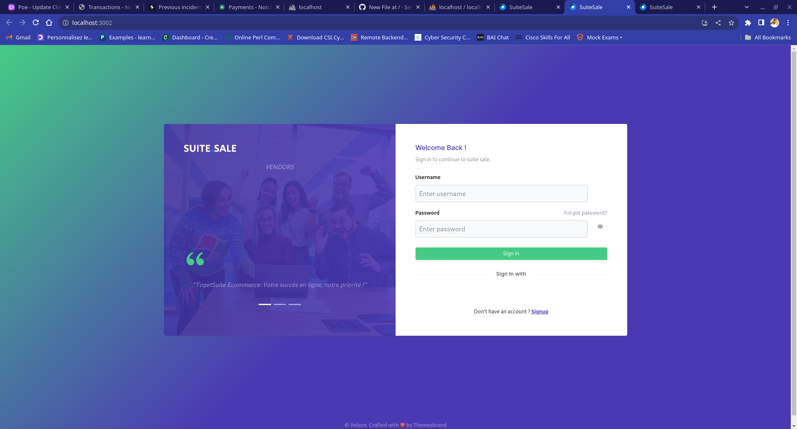
- *Login Partie Vendeur*

  
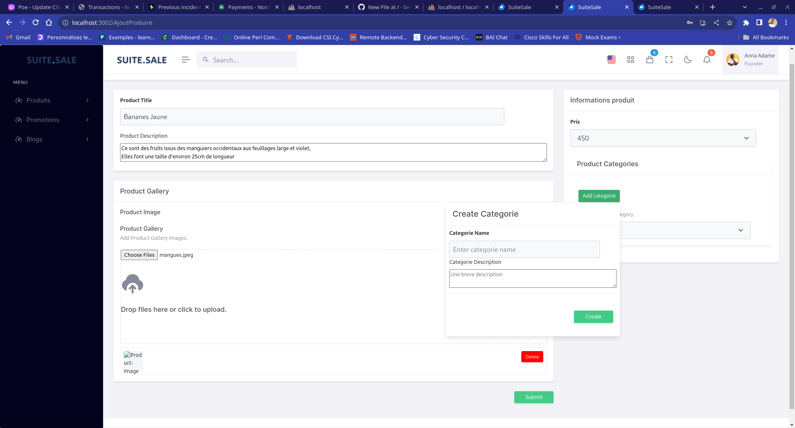
- *Create Product Partie Vendeur*

  
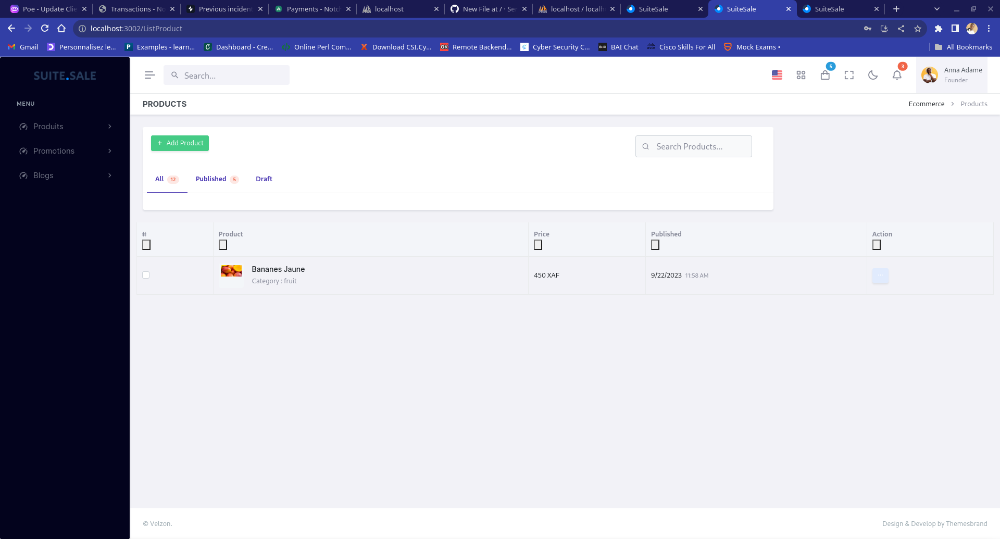
- *List Products Partie Vendeur*

  
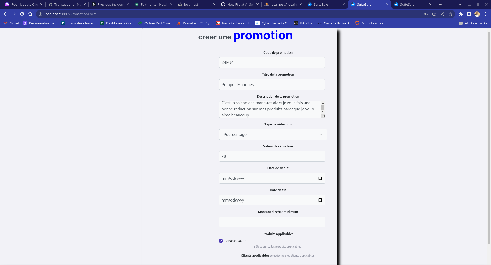
- *Create Promotion Partie Vendeur*

  
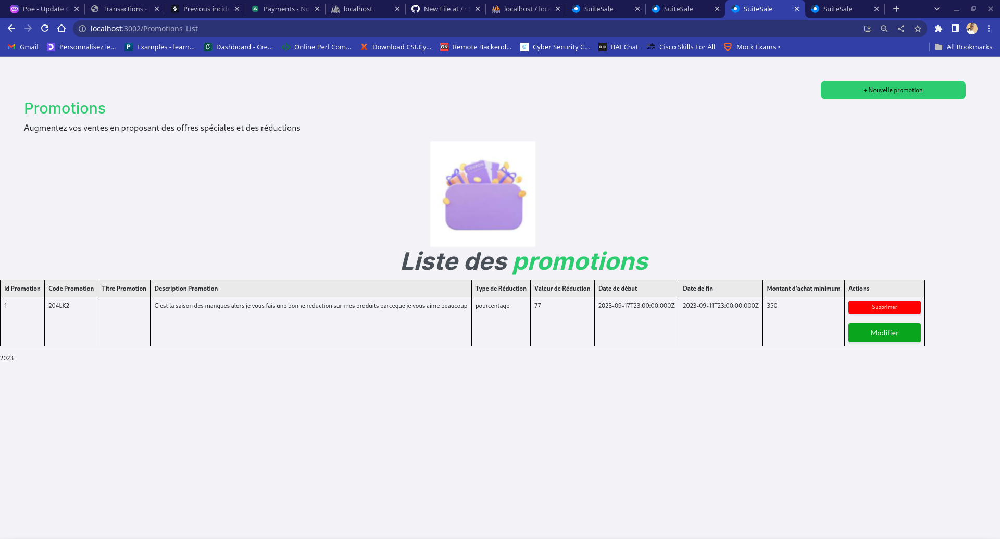
- *List Promo Partie Vendeur*

  
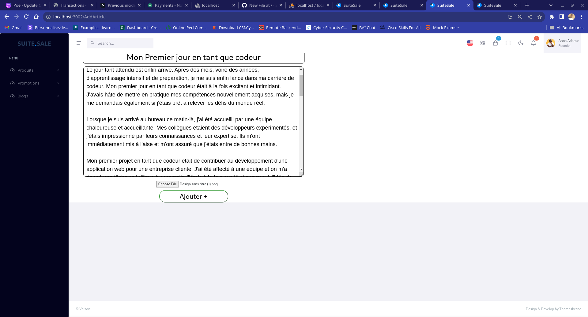
-                               *Create Article Partie Vendeur*

  
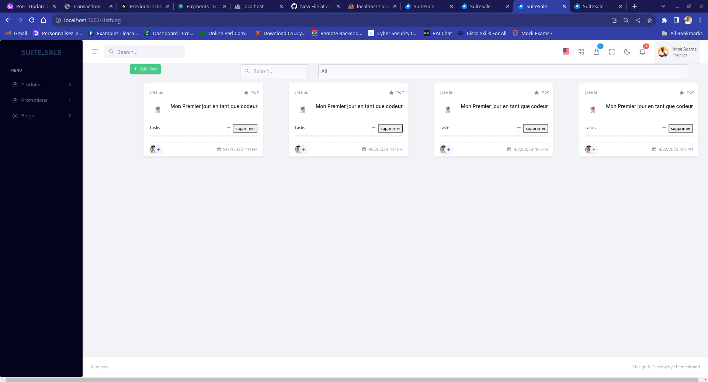
-                               *List Articles Partie Vendeur*

-                               *Delete Article Partie Vendeur*

  
####Partie Vendeur

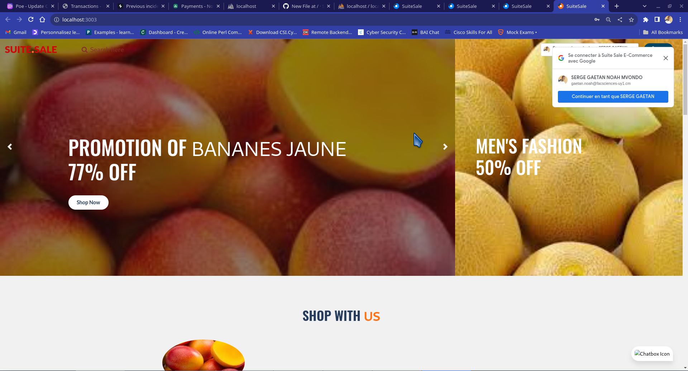
-                               *Accueil  Partie Client*

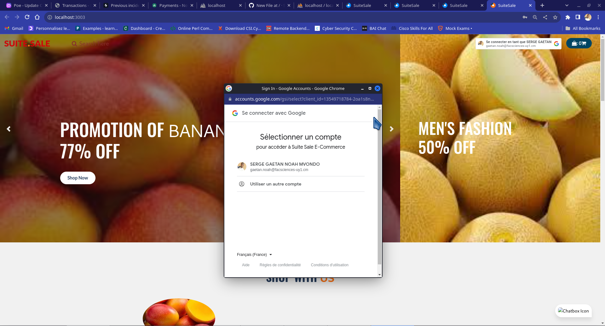
-                               *Login   Partie Client*

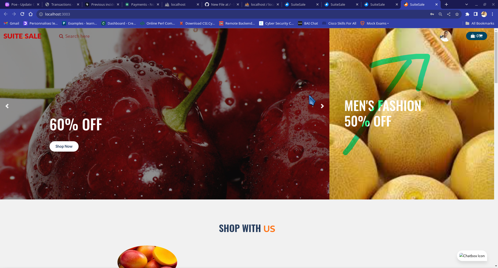
-                               *Login Success  Partie Client*

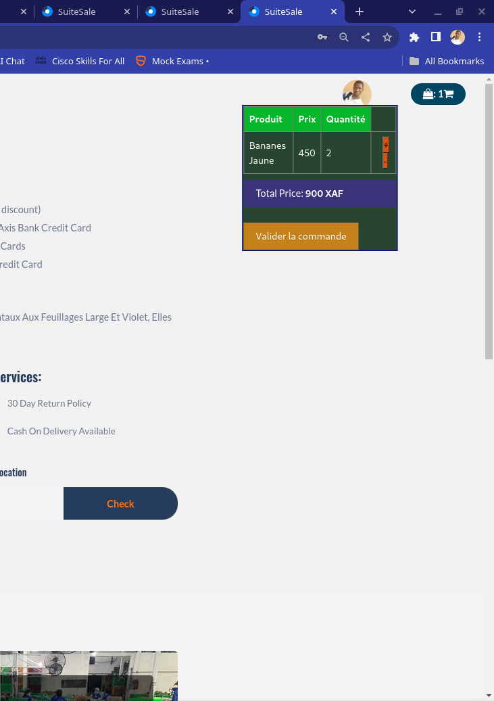
-                             *Panier  Partie Client*

  

-                               *Commande  Partie Client*

  
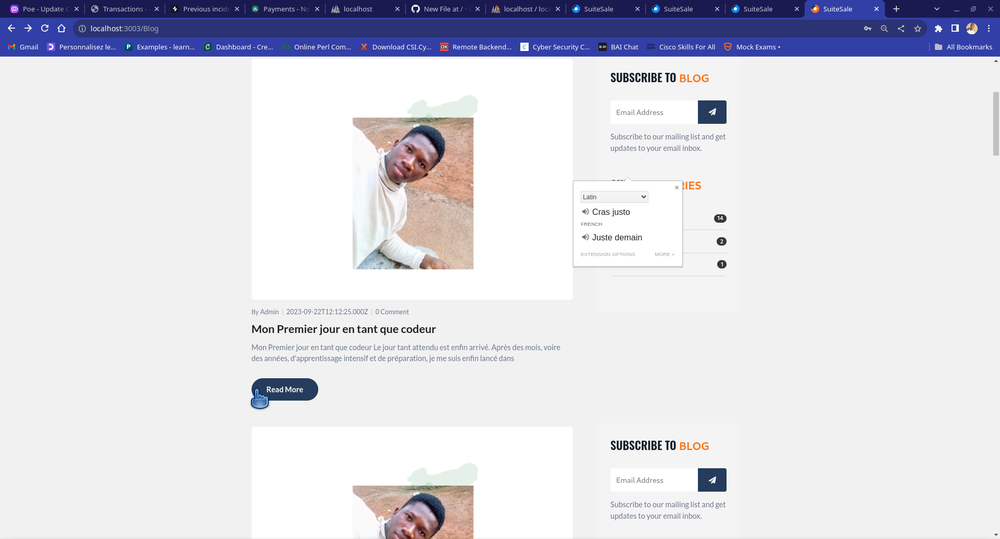
-                               *Article du blog  Partie Client*

  ####Partie Client

N'hésitez pas à explorer l'application pour découvrir toutes les fonctionnalités offertes !

---

*Note : Les captures d'écran sont fournies à titre d'illustration et peuvent différer de l'apparence réelle de l'application.*
